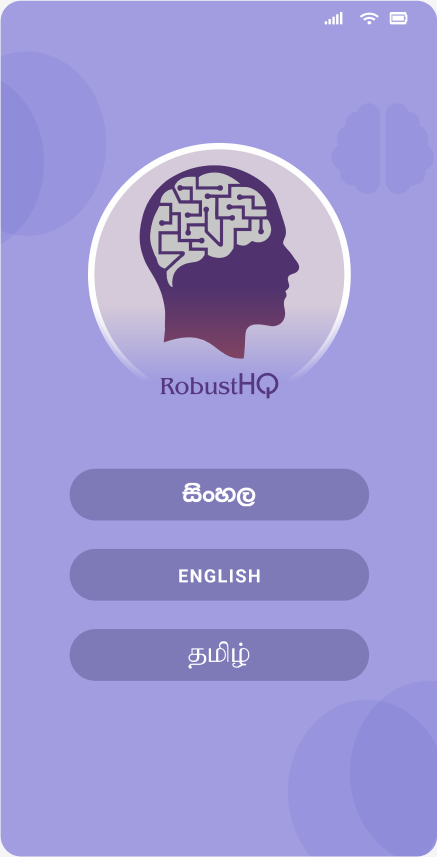
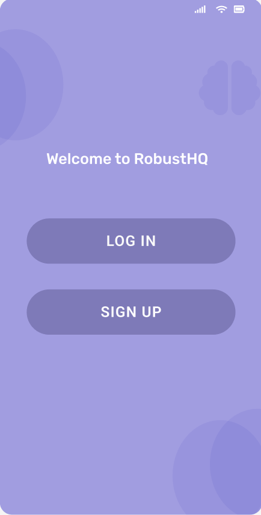
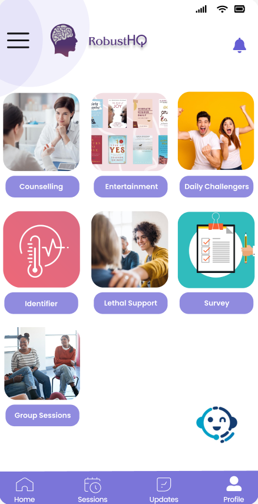
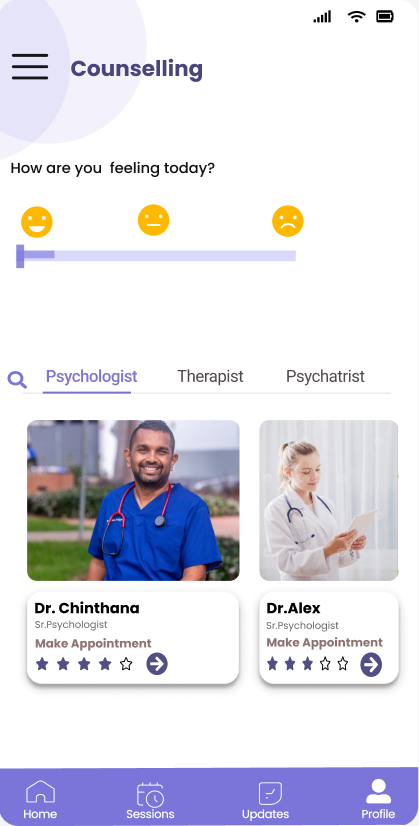
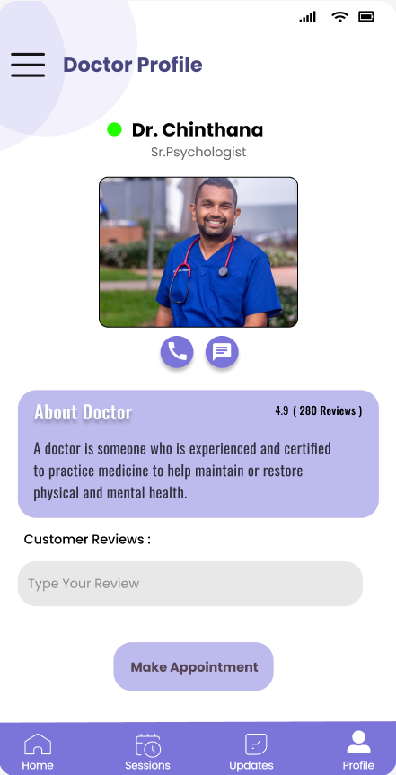
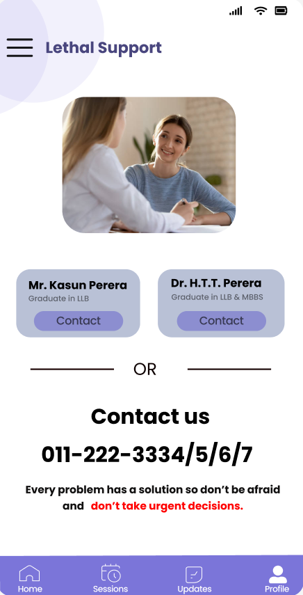

# 🧠 RobustHQ - Mental Health Well-being Application

<div align="center">
  
</div>

## 🌟 About the Project

**RobustHQ** is an innovative mental health mobile application developed to address Sri Lanka's growing mental health crisis. Our platform combines therapeutic tools, professional support, and community features to create a comprehensive mental wellness ecosystem.

> "From depression to approximately 6000 people in the general population attempting suicide, Sri Lanka has been named as the country with the highest rates of suicide cases." - Project Report

## 🚀 Key Features

### 💡 Innovative Solutions
- **Multilingual Support** (Sinhala/English/Tamil)
- **Lethal Support System** with law enforcement integration
- **Daily Therapeutic Challenges**
- **AI-Powered Symptom Identifier**
- **Virtual Library** of mental health resources

### 🩺 Professional Services
- Online therapy sessions (group & private)
- Doctor Q&A forums
- Mental health professional directory
- Progress tracking and reports

### 🌱 Wellness Tools
- Mood tracking journal
- Meditation guides
- Entertainment recommendations
- Community support groups

## 🛠 Tech Stack

### Frontend


### Backend


### Database


## 📊 Impact Metrics

```python
print("Building Future Mental Health Solutions")
while True:
    innovate()
    support()
    heal()
```

<div align="center">
  
</div>

## 🏆 Unique Value Proposition

Our GAP analysis revealed key advantages over competitors:

| Feature               | Local Competitors | RobustHQ |
|-----------------------|------------------|----------|
| Mobile Application    | ❌               | ✅       |
| Lethal Support        | ❌               | ✅       |
| Daily Updates         | ❌               | ✅       |
| Multilingual Support  | ❌               | ✅       |

## 🧩 Prototype Screenshots

<div align="center">
  
  
  
</div>

<div align="center"> 
  <table> 
    <tr> 
      <td align="center"> 
         <br><em>Language Selection Screen</em> </td> 
      <td align="center">
         <br><em>Language Selection Screen</em> </td> 
      <td align="center"> 
         <br><em>Language Selection Screen</em> </td> 
      <td align="center">
         <br><em>Language Selection Screen</em> </td> 
      <td align="center"> 
         <br><em>Language Selection Screen</em> </td> 
      <td align="center">
         <br><em>Language Selection Screen</em> </td> 
    </tr> 
  </table> 
</div>

## 🌐 Future Roadmap

- [ ] AI Chatbot enhancement
- [ ] Wearable integration
- [ ] Anonymous support groups
- [ ] Crisis hotline integration

## 📜 License

This project is licensed under the MIT License - see the [LICENSE](LICENSE) file for details.

<div align="center">
  
  <p>Join us in revolutionizing mental health care in Sri Lanka</p>
</div>
